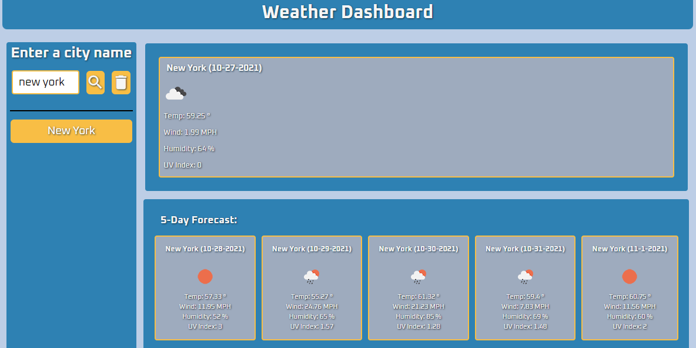

# Weather Dashboard

## **Description**

Application that allow your to lookup the current weather and a 5 day forecast by typing in a city name

 
 ### **Usage**

 User enters a city name in the search box click search.  The current day forecast is displayed and a forecast for the following five days below it.
Search history will also be added as their own buttons beneath the 'Reset History' button.

### **Live URL**
https://rsternik.github.io/Homework_Weather_Dashboard/

### **Preview**

